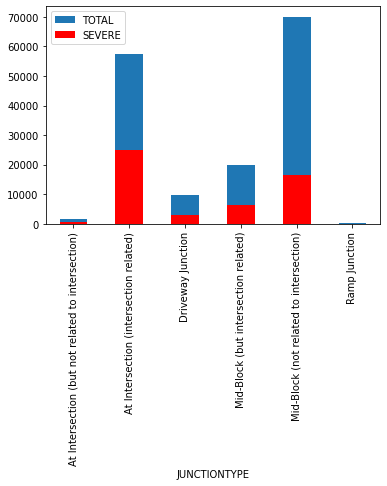
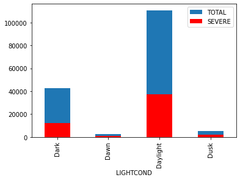
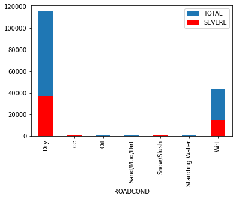

# Capstone Project Report
Stepan Rakhimov

September 17, 2020

## 1. Introduction
### 1.1 Background
Car accidents are still a problem for many nations. Moreover some particular roads or locations tend to have higher probability of accidents and their severity as the others due to various factors.
### 1.2 Problem
Imagine you are driving to another city for work or to visit some friends. It is rainy and windy, and on the way, you come across a terrible traffic jam on the other side of the highway. Long lines of cars barely moving. As you keep driving, police car start appearing from afar shutting down the highway. Oh, it is an accident and there's a helicopter transporting the ones involved in the crash to the nearest hospital. So you start asking yourself if you could take another, probably less dangerous route or even better had something in place that could warn you, given the weather and the road conditions about the possibility of you getting into a car accident and how severe it would be, so that you would drive more carefully or even change your route.

The end goal of this study is to see if we can build a prediction software using Machine Learning from existing historical data.
### 1.3 Interest
As production solution this kind of service might be integrated in to car navigation systems or stand alone application for smartphones. That way it may bring value to people driving in Seattle. Bigger datasets or service partitioning may cover wider areas like whole US or world.
## 2. Data acquisition and cleaning
### 2.1 Data sources
Our data source is open dataset of car accidents in the city of Seattle. It sources from Traffic Management of the city of Seattle and comes as two files: [CSV](https://s3.us.cloud-object-storage.appdomain.cloud/cf-courses-data/CognitiveClass/DP0701EN/version-2/Data-Collisions.csv) file of actual data and [PDF](https://s3.us.cloud-object-storage.appdomain.cloud/cf-courses-data/CognitiveClass/DP0701EN/version-2/Metadata.pdf) file with metadata.

The dataset covers the period from 2004 till 2020 and contains about 200k records. The table has various accident properties such as severity, weather, road, geo point, number of vehicles and persons involved etc. This data should be enough for us to pick meaningful features and build consistent and robust model that fulfills the goal of the study.

The dataset is not suitable for Machine Learning "as is", but it will be after some cleanup and reformat.

It also has 38 fields per every accident, which might be too much for our purpose since 37 dimentions will slow down model training process but may not add to the outcome. So only meaningful features will be selected from the dataset and used as training an test sets.
### 2.2 Data cleaning
First of all we look to the columns available:
```
['SEVERITYCODE', 'X', 'Y', 'OBJECTID', 'INCKEY', 'COLDETKEY', 'REPORTNO',
'STATUS', 'ADDRTYPE', 'INTKEY', 'LOCATION', 'EXCEPTRSNCODE',
'EXCEPTRSNDESC', 'SEVERITYCODE.1', 'SEVERITYDESC', 'COLLISIONTYPE',
'PERSONCOUNT', 'PEDCOUNT', 'PEDCYLCOUNT', 'VEHCOUNT', 'INCDATE',
'INCDTTM', 'JUNCTIONTYPE', 'SDOT_COLCODE', 'SDOT_COLDESC',
'INATTENTIONIND', 'UNDERINFL', 'WEATHER', 'ROADCOND', 'LIGHTCOND',
'PEDROWNOTGRNT', 'SDOTCOLNUM', 'SPEEDING', 'ST_COLCODE', 'ST_COLDESC',
'SEGLANEKEY', 'CROSSWALKKEY', 'HITPARKEDCAR']
```
There few types of columns in the dataset: 
1. accident severity: this is obviously our target data column. According to dataset description it may have 5 different values, but n fact it has only two - property damage and injury. This information will be important for us in the modeling section since it defines kind of algorithms are suitable.
2. internal identifiers: these columns contain identifiers to external resources of the Traffic Management department and bring no value for our goal. All these data should be dropped.
3. accident related data: here we can find weather and light conditions, geographical positions, surroundings of the accident, all the parties involved and so on. This data seems to be good candidates to be our features for prediction models. Closer look to the values shows that most of them have categorical values, those we need to re-encode to numerical values using one-hot encoding.

Ok, now we have to wait with extraction of `SEVERITYCODE` as our target `y` before all the cleanup is done, otherwise `y` and `X` will have different dimensions. 

So we do step 2 and drop columns with irrelevant/internal information:
```
['INCDTTM', 'SDOT_COLDESC', 'COLDETKEY', 'ST_COLDESC', 'SEGLANEKEY', 'SEVERITYDESC', 
'CROSSWALKKEY', 'LOCATION', 'INCDATE', 'PEDROWNOTGRNT', 'EXCEPTRSNCODE', 'OBJECTID', 
'INTKEY', 'SDOTCOLNUM', 'Y', 'X', 'ST_COLCODE', 'EXCEPTRSNDESC', 'SEVERITYCODE.1', 
'SDOT_COLCODE', 'INCKEY', 'REPORTNO']
```
These columns have identifiers, report numbers, text descriptions and geo coordinates. None of this can be used for prediction modeling.

The resulting list of columns looks like this:
```
['SEVERITYCODE', 'STATUS', 'ADDRTYPE', 'COLLISIONTYPE', 'PERSONCOUNT', 'PEDCOUNT', 
'PEDCYLCOUNT', 'VEHCOUNT', 'JUNCTIONTYPE', 'INATTENTIONIND', 'SPEEDING', 'HITPARKEDCAR', 
'WEATHER', 'ROADCOND', 'LIGHTCOND', 'UNDERINFL']
```
It looks pretty valid, but it also has two interesting columns to look deeper: `UNDERINFL` and `STATUS`
- `STATUS` column has only one value "Matched", so we clean up all lines that do not have the value, i.e. "unmatched".
- `UNDERINFL` column shows if the driver was influenced by drugs or alcohol. We definitely need to remove accidents caused by those reasons, since driver should never sit behind the wheel in this condition in the first place.
Column has values: `0`, `1`, `Y` and `N` which means we should replace `Y` with `1` and `N` with `0` to make it consistent and then drop all the lines with value `1`.

After this we can safely drop `UNDERINFL` and `STATUS` columns from the dataset.

Looking further to remaining columns we see that `JUNCTIONTYPE`, `WEATHER`, `ROADCOND`, `LIGHTCOND` have "Unknown" and/or "Other" values. Those we remove too because there is no way to fill those gaps.

Next comes `SPEEDING` column: it contains only `Y` and `Nan` values, so it's easy to be converted to `1` and `0` respectively.

We are nearly done with cleaning and ready to convert categorical values into "one hot". 
`LIGHTCOND` field has too many categories related to "Dark" road conditions, we'll merge them al into one "Dark" category.
Now we a ready for the next step.

### 2.3 Feature selection
Let's look again to the list of columns we have:
```
['ADDRTYPE', 'COLLISIONTYPE', 'PERSONCOUNT', 'PEDCOUNT', 'PEDCYLCOUNT', 'VEHCOUNT', 
'JUNCTIONTYPE', 'INATTENTIONIND', 'SPEEDING', 'HITPARKEDCAR', 'WEATHER', 'ROADCOND', 'LIGHTCOND']
```
they look valid to be our features so far. But we should keep in mind the end goal of the exercise: we would like to predict accident severity before the actual accident so we can warn the driver or pick another route.
Some of this features are impossible to know beforehand, because they are features of the accident itself, so we have to drop them here even knowing that models would show better results with them.

Here we drop:
```
['PEDCOUNT', 'VEHCOUNT', 'HITPARKEDCAR', 'COLLISIONTYPE', 'PEDCYLCOUNT', 'INATTENTIONIND']
```
this leaves us with final list of features:
```
['ADDRTYPE', 'PERSONCOUNT', 'JUNCTIONTYPE', 'SPEEDING', 'WEATHER', 'ROADCOND', 'LIGHTCOND']
```

### 2.4 Data transformation
Some data transformation has to be done before we can continue.

`ADDRTYPE`, `JUNCTIONTYPE`, `WEATHER`, `ROADCOND`, `LIGHTCOND` are all categorical, so we convert them into "one hot" encoding using `get_dummies` method.

Now it's time to extract `SEVERITYCODE` into `y` dataset and call the remaining as `X`.

Since severity codes are actually only two values of `1` and `2` it possible to just make them `0` and `1` respectively, which makes its meaning even more obvious for anyone.

At this point all the columns are of integer type and it makes possible to call `corr()` method and see which features are actually independent from each other.
We set correlation threshold to 0.9 and that gave the following results:

| Feature | Feature | Correlation |
| ---- | ---- | ---- |
| ADDRTYPE_Block                                     | ADDRTYPE_Intersection | 0.983682 |
| JUNCTIONTYPE_At Intersection (intersection related)| ADDRTYPE_Intersection | 0.976191 |
| ROADCOND_Wet                                       | ROADCOND_Dry          | 0.967011 |
| JUNCTIONTYPE_At Intersection (intersection related)| ADDRTYPE_Block        | 0.960604 |

Table gives simple list of coluns to drop:
```
['ROADCOND_Wet', 'JUNCTIONTYPE_At Intersection (intersection related)', 'ADDRTYPE_Block']
```

This is it! This will be out dataset for further work.
```
['PERSONCOUNT', 'SPEEDING', 'ADDRTYPE_Alley', 'ADDRTYPE_Intersection',
'JUNCTIONTYPE_At Intersection (but not related to intersection)',
'JUNCTIONTYPE_Driveway Junction',
'JUNCTIONTYPE_Mid-Block (but intersection related)',
'JUNCTIONTYPE_Mid-Block (not related to intersection)',
'JUNCTIONTYPE_Ramp Junction', 'WEATHER_Blowing Sand/Dirt',
'WEATHER_Clear', 'WEATHER_Fog/Smog/Smoke', 'WEATHER_Overcast',
'WEATHER_Partly Cloudy', 'WEATHER_Raining', 'WEATHER_Severe Crosswind',
'WEATHER_Sleet/Hail/Freezing Rain', 'WEATHER_Snowing', 'ROADCOND_Dry',
'ROADCOND_Ice', 'ROADCOND_Oil', 'ROADCOND_Sand/Mud/Dirt',
'ROADCOND_Snow/Slush', 'ROADCOND_Standing Water', 'LIGHTCOND_Dark',
'LIGHTCOND_Dawn', 'LIGHTCOND_Daylight', 'LIGHTCOND_Dusk']
```
with shapes:
```
X = (161321, 28)
y = (161321,)
```

## 3. Exploratory Data Analysis
### 3.1 Calculation of target variable
Our target variable is defined by `SEVERITYCODE` and essentially has 2 possible values: `0` and `1` which shows if the accident caused injury or not.
It looks like a classification probel since we have no options between 0 and 1 here.
The goal is to predict based on incoming parameters the severity of the accident and possibly the probability of this outcome.

Moreover, the accident outcome values are not actually equal. While it would be great to predict all 100% of accidents, it's not possible in practice.
So we will be false positives and false negatives.

In case of injuries it's much safer to predict danger in case it's not there than predict safe route when it's not.
So in our case we should minimize false negatives as much as possible, but still keep prediction in line.
   
### 3.2 Relationship between selected features and accidents
Just to ge some grip on relations between amount of accidents and their severity, we built some bar charts that represent total amount accidents and amount of severe accidents in relation to features in our final dataset.
To perform this action we had to make one step back and take the dataset before one-hot encoding has been executed.

Since `PERSONCOUNT` is the only non-categorical value here, that chart required a bit more visualisation work.







## 4. Predictive Modeling
The problem seems to be of classification type. We have data about accidents with some fixed outcome, in our case accident caused injury or not.
So the plan is to try different classification algorithms and see which performs better with our data. 
We'll probably prefer models that can also provide probability values of the outcome because it's widens the area of application.

### 4.1 Classification models
#### 4.1.1 Applying standard algorithms and their problems
It's not clear from the beginning which model will do best before actual modeling.
This also means there is no way to know which parameters' values should be used.
So for starters we use classification algorithms from the Data Science course: decision tree, k-means, logistic regression, support vectors.
All the models were trained with different parameter's values:
- tree depth from 3 to 30 for decision tree
- number of neighbours n from 1 to 30 for k-means
- `newton-cg`, `lbfgs`, `liblinear`, `sag`, `saga` solvers and regularisation value 1, 0.5, 0.1, 0.005, 0.01 for logistic regression
- `linear`, `poly`, `rbf`, `sigmoid` kernels for support vectors.

The goal was to see them in action, find out which parameters work best and observe performance.
Our initial split to train/test datasets was 80/20, but it became immediately obvious that k-means and support vector models took too much train and test time to be used at discovery phase.
So the dataset was reduced more to about 13000 train and 3000 test records.

Models were evaluated using `f1_score` metric which appeared to deliver better results in our case that `accuracy_score`.
Based on best `f1_score` final parameter's values were chosen for all algorithms except logistic regression.
- depth=10 for decision tree
- n=21 for k-means
- `rbf` kernel for support vectors 

Logistic regression was the only model that showed equal results for any combination of parameters, so it was decided to leave it on default values of `lbfgs` as solver and 1.0 as regularisation value. 

Later on Ridge classifier and random forest classifiers were added to the list of candidate algorithms.
For random forest same logic was used to discover best depth value, it turned to be 3, i.e. it is easier to visualise than decision tree with its depth of 10.


After the parameter's values discovery, all the models were trained on full dataset with 80/20 split to train/test data.

For those models, among `f1_score`, other metrics were calculated:
- `accuracy_score`
- `confusion_matrix`
- `log_loss`
- `classification_report` for both test and train sets, so we can see if there is any overfitting.

Together with training performance of K-Means and SVM models new problem appeared when confusion matrices were drawn.
Model tend to predict more non-severe cases than existed in the test set.
This situation is unfavourable as mentioned above in section 3.1.

#### 4.1.2 Solution to the problems
Mitigation of the problem turns out to be obvious. We need to assign more weight to more important class.
The best achieved solution with with `class_weight="balanced` while manual weights assignment was also tries with less success.
Final confusion matrices for different models look the following way:


Some models look better than others but in general the result is much closer to what was expected. 
Prediction isn't perfect, but at least it does not give the feeling of false safety when it is not safe on the road. 
#### 4.1.3 Performances of different models
Having achieved satisfactory results with confusion matrices, models were rebuilt and f1, accuracy and logloss scores were recalculated.
In our case f1 score seems to be much more useful during model performance evaluation than accuracy score. 
Logloss score is available only for limited number of algorithms, but also shown for completeness.


With the exception of GradientBoostingClassifier results look pretty similar.
Looking at f1 score our leader is RidgeClassifier, its confusion matrix looks good, it trains quickly on full set of data and the only disadvantage is absence of prediction probability.
So for use case where probabilities are not required it is a good choice.

The alternative for the same use case could be SVC, its confusion matrix shows even less wrong predictions of false severe accidents, but f1 score is lower and it takes much more computation time to train the model.

When we really need prediction probabilities, other models should be taken. 
Here we have a choice between LogisticRegression, RandomForestClassifier and DecisionTreeClassifier.
From f1 score perspective logistic regression is the best candidate, but it lacks results interpretation, prediction probability is the only thing we can get.

So if we are required to know the  path that were taken to obtain the end result, then DecisionTreeClassifier or RandomForestClassifier should be used.
Both of then is possible to visualise, both provide prediction probability, both are quick to train and both show reasonable f1 score.

Taking into account logloss score DecisionTreeClassifier becomes the leader, but due to its depth it might be harder to visualise, its visualisation image is even too big to be included into this text.
## 5. Conclusions
As mentioned above, different models achieved comparable performance scores, so there is real choice between them and it depends mostly on future applications.
To make things simple, here is the staring point of choice:
- severity yes/no answer - RidgeClassifier with alternative of SVC
- severity probability - DecisionTreeClassifier with alternative of LogisticRegression and RandomForestClassifier
## 6. Future directions
While accuracy results and confusion matrices look acceptable, they are definitely not the best. 
It should be possible to achieve better prediction and less false positives/negatives.

More features may help here since we had to drop those that are not possible to know before the accident. For example business of the road or average amount of cars, pedestrians and cyclists per time of the day.
Day of week may play its role or type of car, age of the driver and his driving experience, maybe also sex.

It's even possible that dropping some features may also help.   
 
Most probably there are other algorithms out there that may perform better on our dataset.
